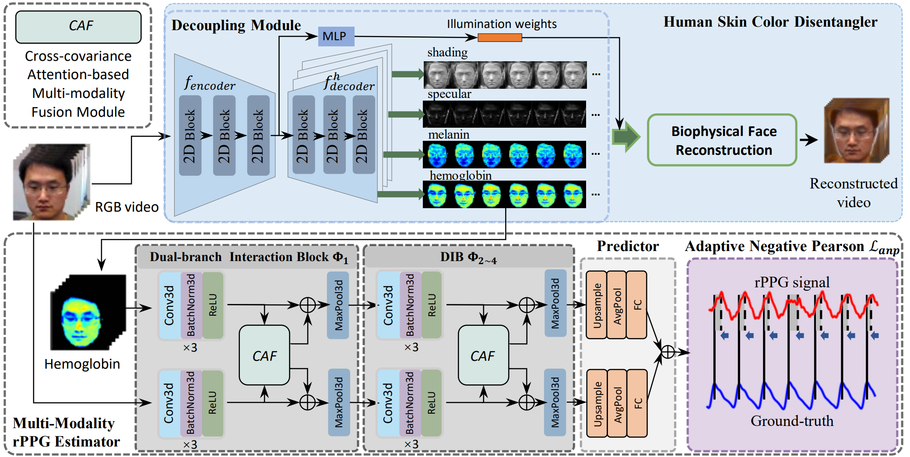

# hemnet
The source code of hemnet
## The Main Code of "HemNet: Hemoglobin-Assistant Network for Video-based Remote Photoplethysmography Measurement"



### Train HemNet on the PURE dataset:
```python
python train.py --batch_size 2 --dataset PURE --num_rppg 160 --norm_type reconstruct --w 64 --h 64 --epochs 50
```

### Log files will be saved in:

```python
./logs/model_dataset_numframes_date_time.log
```

### Evaluate HemNet on the PURE dataset:

```
./test_results.ipynb
```

### Pre-trained models and resources used in HemNet ([Google Drive](https://drive.google.com/drive/folders/1PX4ioIA7fh72XgMe8mbZE2TOhuvwrWeq?usp=drive_link)):

- `bioface/`：Resources related to bio-facial data.
- `face_parsing/79999_iter.pth`：Pre-trained model for face parsing.
- `SfSNet/SfSNet.pth`：Pre-trained model for shading estimation.
- `shape_predictor_68_face_landmarks.dat`： Model for facial landmark detection.

### If HemNet is helpful, please cite our method:

```

```
